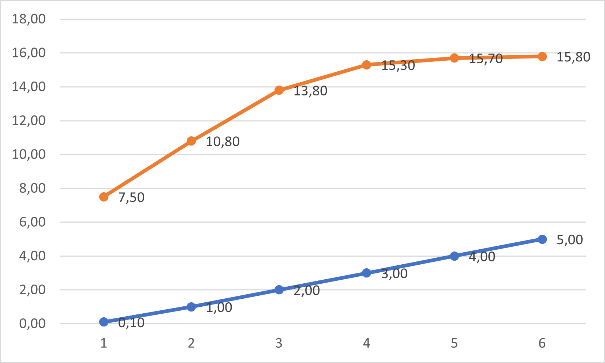
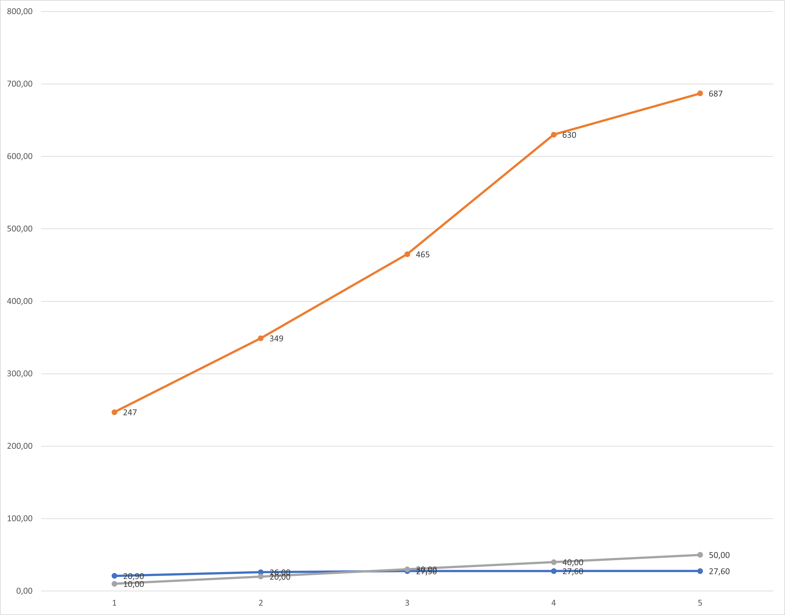

# KCIM_Mikhailov_lab1
# СПм-22-6, Міхайлов Ілля Олегович
### Лабораторна робота №**1**. Опис імітаційних моделей та проведення обчислювальних експериментів

 

### Варіант 13, модель у середовищі NetLogo:
[Fruit Wars](http://www.netlogoweb.org/launch#http://www.netlogoweb.org/assets/modelslib/Sample%20Models/Social%20Science/Traffic%20Basic.nlogo)

 

### Вербальний опис моделі:
Модель Fruit Wars демонструє, як економічне середовище з ненульовою сумою може заохочувати співпрацю та перешкоджати насильству. Здобувачі корму(ЗК у майбутньому) блукають по карті в пошуках плодових чагарників. Коли вони прибувають до плодового куща, вони отримують енергію шляхом пошуку їжі, доки плодовий кущ не вичерпає ресурси. Ці тварини розмножуються та передають свої характеристики нащадкам після збору певної кількості енергії. Вони також приймають рішення на основі спадкових параметрів щодо того, як взаємодіяти з іншими тваринами, які шукають їжу. ЗК можуть співпрацювати, погрожувати, воювати чи тікати за різних обставин.
У моделі ЗК можуть або співпрацювати, або боротися на основі спадкових атрибутів агресії. Параметр "бонус за співпрацю" у моделі контролює, наскільки корисною є співпраця з точки зору пошуку їжі, тому слід очікувати, що еволюційна рівновага системи рухається в бік збирачів з менш жорстокими тенденціями, коли модель запускається з вищими налаштуваннями "бонусу за співпрацю".

### Параметри Setup:
- **initial-fruit-bushes** - кількість плодових кущів на початку.
- **initial-foragers** - кількість ЗК на початку.

### Параметри візуалізації:
- **show-energy?** - відображає поточну енергію кожного окремого ЗК поряд з ним, якщо ввімкнено.
- **visualization** - масштабує колір агента залежно від вибору на основі значення цього параметра, причому світліші кольори представляють більш високі значення.

### Параметри, що можуть надавати вплив під час роботи симуляції:
- **ticks-to-flee** - Кількість тіків, що повинно пройти після початку побігу ЗК перед тим, як він почне шукати новий фруктовий кущ.
- **rate-of-mutation** - Ймовірність того, що окремий біт перевернеться під час проходження біта генома від батька до нащадка.
- **collaboration-bonus** - Коефіцієнт, який використовується для визначення рівня спільного пошуку їжі. Вищий бонус за співпрацю означає вищі показники збирання корму кількома ЗК на одному кущі.
- **max-age** - Максимальна кількість тіків, що може прожити один ЗК
- **bush-growth-chance** - Шанс, щоб новий фруктовий кущ виростав на кожному кроці.

### Показники роботи системи:
- Population - Кількість ЗК на даний момент часу.
- Avg Population - Середня кількість одночасно існуючих ЗК.
- Traits over Time - Середньостатистичне значення атрибутів ЗК.
- Deaths by Time - Кількість та тип смертей.
- Types of Aggression(Mean/Histogram) - Показник кількості виникнення агресії та типу її збудника.
- Forage Rate - Кількість зібраного корму.

### Примітки:
1) При зміні параметрів, показник "collaboration-bonus" неможливо зробити нижче 0.1(наприклад 0), а це б дозволило симулювати ситуацію, де імовірно усі ЗК були б "вигнанцами".
2) Можливо прискіблення, але у започатковця драки немає можливості наздоганяти ЗК, що тікає. Можна було б додати можливість відбирати корм у вбитого - тоді б ЗК прийшлося б вірішувати або коллаборація або мародерство.
3) При збільшенні швидкості симуляції (model speed) споживає багато ресурсів ЕОМ.

### Недоліки моделі:
1) Нащадок(група нащадків) може з'явитись без причини, навіть якщо залишився лише один ЗК.
2) У ЗК, що не голодує та не є об'єктом вбивства немає можливості померти раніше, ніж на 500 тік, що не зовсім реалістично.
 

## Обчислювальні експерименти
 
### 1. Вплив залежності здобутого корму від бонусу за співпрацю
Досліджується залежність Forage Rate від collaboration-bonus.
Експерименти проводяться при 40 початкових ЗК та 40 початкових існуючих фруктових кущів, протягом певної кількості тактів (200) з кроком 1, усього 6 симуляцій.  
Інші керуючі параметри мають значення за замовчуванням:
- **ticks-to-flee** 45
- **rate-of-mutation** 1
- **max-age** 500
- **bush-growth-chance** 6

<table>
<thead>
<tr><th>Здобутий корм</th><th>Бонус за співпрацю</th></tr>
</thead>
<tbody>
<tr><td>7.5</td><td>0,1</td></tr>
<tr><td>10.8</td><td>1</td></tr>
<tr><td>13.8</td><td>2</td></tr>
<tr><td>15.3</td><td>3</td></tr>
<tr><td>15.7</td><td>4</td></tr>
<tr><td>15.8</td><td>5</td></tr>
</tbody>
</table>

Графік наочно показує, що ніж більше ми заохочуємо співпрацю - тим більше корму збирають здобувачі, але швидкість зростання кількості зібраного корму зменшується через те, що хоч здобувачі й починають працювати колективно та менше вбивають одне одного, але їм все ще бракує інших показників(як наприклад кількість фруктових кущів).

### 2. Вплив збільшення шансу появи куста на кількість здобутого корму та популяцію
Досліджується Forage Rate та Population, в залежності від bush-growth-chance.
Експерименти проводяться при 40 початкових ЗК та 40 початкових існуючих фруктових кущів, протягом певної кількості тактів (200) з кроком 10, усього 5 симуляцій.
Інші керуючі параметри мають значення за замовчуванням:
- **ticks-to-flee** 45
- **rate-of-mutation** 1
- **collaboration-bonus** 5
- **max-age** 500

<table>
<thead>
<tr><th>Здобутий корм</th><th>Популяція</th><th>Шанс на появу куща</th></tr>
</thead>
<tbody>
<tr><td>20.9</td><td>247</td><td>10</td></tr>
<tr><td>26</td><td>349</td><td>20</td></tr>
<tr><td>27.5</td><td>465</td><td>30</td></tr>
<tr><td>27.6</td><td>630</td><td>40</td></tr>
<tr><td>27.6</td><td>687</td><td>50</td></tr>
</tbody>
</table>

Графік наочно показує, що ніж більше фруктових кущів у нас є тим більше популяція та кількість здобутого корму. Але з незрозумілої причини як і у минулому експерименті темп збільшення показників з часом сповільнюється.

### 3. Підбір значень параметрів для виявлення, який з переліку найбільш впливає на кількість вбивств
Досліджуються усі параметри окрім ticks-to-flee та rate-of-mutation.
Експерименти проводяться при 40 початкових ЗК та 40 початкових існуючих фруктових кущів, протягом певної кількості тактів (200) усього 4 симуляцій.
- **ticks-to-flee** 45
- **rate-of-mutation** 1

<table>
<thead>
<tr><th>№Підексперименту</th><th>Бонус за співпрацю</th><th>Максимальний вік</th><th>Шанс на появу куща</th><th>Перше вбивство(такт)</th><th>Початок спаду(такт)</th><th>Кінцеве співвідношення вбивств</th></tr>
</thead>
<tbody>
<tr><td>1</td><td>5</td><td>500</td><td>6</td><td>73</td><td>100</td><td>26%</td></tr>
<tr><td>2</td><td>0,1</td><td>500</td><td>6</td><td>23</td><td>126</td><td>85%</td></tr>
<tr><td>3</td><td>5</td><td>100</td><td>6</td><td>41</td><td>100</td><td>42%</td></tr>
<tr><td>4</td><td>5</td><td>500</td><td>1</td><td>12</td><td>145</td><td>25%</td></tr>
</tbody>
</table>

Під час експерименту було виділено такі спостереження:
 - У підексперименті 1 були стандартні умови, де максимальний бонус за співпрацю, максимальний  макс. вік, стандартний шанс на появу куща(6). Перше вбивство сталося на 73 такті, що не дуже рано, що означає, що якийсь час ЗК були задовільнені великим бонусом за співпрацю та не думали про вбивство, але один з них вирішив вбити когось(можливо щоб самостійно збирати кущ, а не ділити) та передав цю черту іншим ЗК(нащадкам). Але лише після 100 такту(через 17 тактів) процент вбивств швидко почав спадати(мабуть все ж таки більшість ЗК вирішила, що бонус за співпрацю уж дуже приємний). Процент вбивств на 200 такті ставить 26%. На мою думку це найкращий результат за усіх підекспериментів.
 - У підексперименті 2 були стандартні умови, тільки бонус за співпрацю був мінімальним(0,1). Перше вбивство - 23 такт, що дуже рано(все ж таки боротьба з конкурентами), тільки на 126 такті(через 103 такти) процент вбивств почав бути нижче 100%, але нижче останніх 85% так і не впав. На мою думку гірший результат.
 - У підексперименті 3 були стандартні умови, тільки максимальний вік був знижений з 500 до 100. Вперше  вбили на 41 такті(середня ранність) та на 100 такті(через 59 тактів) кількість вбивств різко впала до 50%(Судячи з усього можна припустити два варіанти - або вирішили не витрачати наданий їм час на вбивства, або вирішили, що конкуренти помруть самі від віку). Останній процент вбивств 42%. Середній результат.
 - У підексперементі 4 були стандартні умови, але ймовірність зростання куща була зменшена з 6 до 1. Перше вбивство сталося на 12 кроці(найраніший результат, напевно через дуже малу кількість кущів та корму відповідно). Спадати процент вбивств почав лише на 145 такті, та й лише через те, що майже нікого було вбивати - популяція була близько 40 та не дуже зростала. Кінцева кількість вбивств 25%, що є найменшим процентом, але через надмірно малу популяцію та серію вбивств у минулих тактах цей результат неможливо вважати добрим.

### Примітки:
- Підексперимент 3 був єдиним випадком, коли були смерті від віку.
- Під час експерименту значення втратили достовірність через факт існування багатьох змінних, що змінюються саммостійно під час симуляції.
